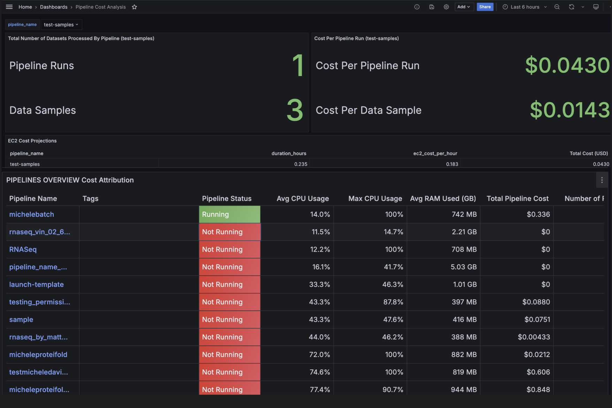
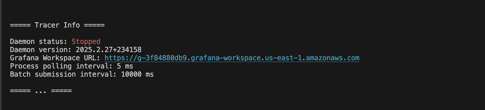

<h2 align="left">
Tracer Linux Agent: Observability for HPC Workloads
</h2>


## What Is Tracer and Why Use It? 
- Tracer is a monitoring solution that optimizes HPC workloads for speed and cost efficiency. It features a one-line install Linux agent and instant dashboards for real-time insights into scientific computing environments.

- Unlike industry agnostic monitoring agents, Tracer structures DevOps data for scientific pipelines, providing clear visibility into pipeline stages and execution runs. In environments like AWS Batch, users struggle to track which processes or containers belong to the same pipeline and frequently lose logs from failed containers, making debugging difficult.

- Tracer solves this by intelligently organizing and labeling pipelines, execution runs, and steps. Because it runs directly on Linux, it requires no code changes and supports any programming language, unlike point solutions that work only with one framework. This makes integration effortless across multi-workload IT environments, including AlphaFold, Slurm, Airflow, Nextflow, and even local Bash scripts.

- Architected for regulated industries, it ensures enterprise-grade security, with data never leaving your infrastructure, which is not the case with solutions such as DataDog. 

## Key Features 
New metrics that help you speed up your pipelines and maximize your budget:
- Time and cost per dataset processed
- Execution duration and bottleneck identifcation for each pipeline step
- Cost attribution across pipelines, teams, and environments (dev, CI/CD, prod)

<br />



## ⚡️ More Powerful Capabilities:
- Unified Monitoring: Track all your HPC pipelines in a single, centralized dashboard
- Faster Debugging: Identify CPU, RAM, and I/O bottlenecks instantly, and never lose AWS Batch container logs again
- Optimization & Savings: Spot computional waste and cut costs by up to 45% in computational biology workloads
- Enterprise-Grade Security: Airgapped deployment keeps all data within your infrastructure
- Upcoming Roadmap:
    - Q1 2025: Advanced Cost Attribution
    - Q2 2025: Performance Optimization for HPC
    - H2 2025: Automated Error Database

## Quickstart Installation
### 1. Install Tracer With One Line of Code
Run the following command to install Tracer on your Linux Ubuntu system:
```bash
curl -sSL https://install.tracer.cloud/installation-script.sh | bash && source ~/.bashrc
 ```
### 2. Initialize a Pipeline
Set up your pipeline by specifying a name:
```bash
tracer init --pipeline-name <YOUR_PIPELINE_NAME>
 ```

### 3. Infrastructure Setup  
You can run a single command from this repository to provision the required infrastructure:
- AWS account with access to a PostgreSQL database
- Grafana instance (Amazon Managed Grafana recommended)

```bash
cd infrastructure && terraform apply
 ```

### 4. View Instant Dashboards 
Run the following command to retrieve your dashboard URL:

```bash
tracer info
 ```

Open the link to access real-time dashboard insights into your computational workloads:




## Table of Contents
- [🔍 Examples](docs/EXAMPLES.md) – Explore real-world use cases 
- [🛣️ Infrastructure Setup](docs/INFRASTRUCTURE_SETUP.md) – 1 Command deployment
- [📚 Development](DOCUMENTATION.md) – Learn more about how to setup your development environment
- [🤝 Contributing](docs/CONTRIBUTING.md) – Join the community and contribute


## Mission

> *"The goal of Tracer's Rust agent is to equip scientists and engineers with DevOps intelligence to efficiently harness massive computational power for humanity's most critical challenges."*
